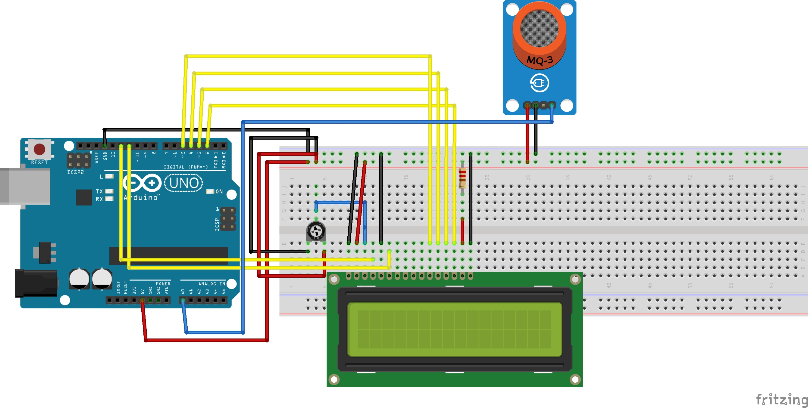

# Projet-P-Protector

@Diaset35 @orokronos
https://p-protect.weebly.com

## synopsis

Et pourquoi ça pue ?

Ces flatuosités, comme les appellent les médecins, sont la plupart du temps très malodorantes. Pourtant, la plupart des gaz libérés sont inodores : dioxyde de carbone, hydrogène et méthane. Mais le pet contient aussi du __sulfure d'hydrogène__, célèbre pour son odeur d'œuf pourri. Le __scatole et l'indole__ sont deux produits chimiques également présents dans le pet et qui sentent particulièrement mauvais. Pourtant, bizarrement, ils sont couramment utilisés en parfumerie : à petites doses, ils sentent très bon. 

## P.PROTECT

Qu'est ce que __P.PROTECT__ ? à usage préventive ou potache,__P.PROTECT__ vous sert d'avertisseur d'odeurs gênante.Qui n'a jamais vecu cet situation ? ou quand vous passez au toilette après quelqu'un dans un lieu public,vous vous retrouvez nez au mur face à cet odeur,vous donnant presque envi de vomir ... __P.PROTECT__ a été conçu pour vous avertir de ses mauvaises odeur ! Qui peuvent ruiner une réputation ou le contraire ...

# Video

# Schema montage MQ5

